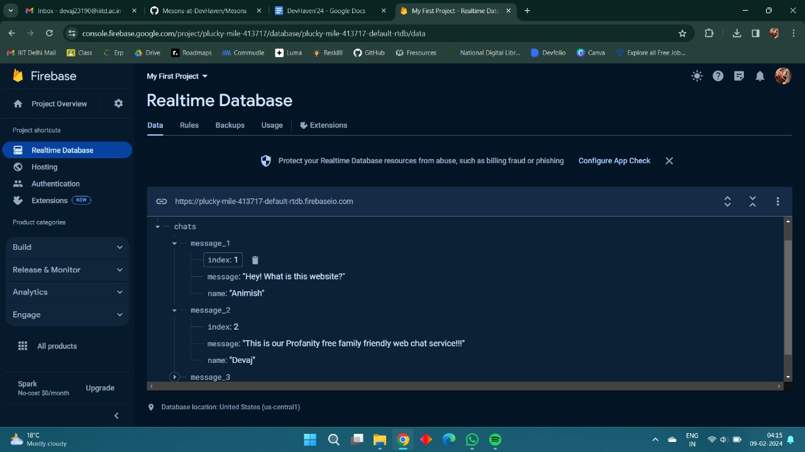

# Mesons DevHaven Hackathon Project

## Team Name: Mesons
## Event Name: DevHaven

Welcome to our DevHaven hackathon project! This README file will provide an overview of our project and guide you on how to get started.

## Project Description

  We built a family-friendly web chat service that uses a profanity filters API and translation API to get desired results.

## Installation

Use the link provided to access the website hosted on Vercel.
https://mesons.vercel.app

## Usage

First, enter the username to enter the chat screen and upload your texts to the Firebase storage.
You can access the website from multiple browsers simultaneously to interact.

For the Python file, make sure to install all the modules used and you can simply run the file.

*We intented to make this a combined system, but due to skill issues 🥲we couldn't call the python function from Javascript therefor

## APIs Used

Azure cognitive services text Translation API
PurgoMalum Profanity filter- RestAPI

## Images of the Application and internal dashboards.
Front End

Firebase RealTime Database Dashboard

Azure API Call Metrics

## Contact
Team MESONS

Devaj Rathore 

Animish Yadav

Manaswi Singh

Divyanshi Beniwal
